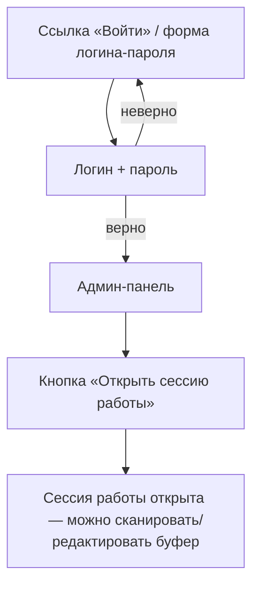

# Модель доступа

Закрывает открытый вопрос №3 из [корневого README](../README.md)
(«Аутентификация в сети»). Как и [docs/scanning-grammar.md](scanning-grammar.md),
фиксирует согласованное и явно помечает то, что ещё не решено —
**реализации в коде пока нет**, это только дизайн.

## Три роли

1. **Гость** — дефолт для любого, кто просто открыл адрес сервера. Ничего
   не видит, попадает на страницу входа.
2. **Читатель** — доступ на просмотр содержимого склада (каталог, остатки),
   без права что-либо менять.
3. **Админ** — полный доступ: всё, что уже умеет backend (открытие/коммит/
   откат/заморозка сессии работы, создание ячеек/предметов, ручное
   редактирование буфера, настройки).

## Доступ на чтение — настраиваемый переключатель

Не просто вкл/выкл, а один параметр с тремя значениями (хранится в том же
файле конфигурации, что и остальные настройки — см. §8
[docs/scanning-grammar.md](scanning-grammar.md)):

| Значение | Поведение |
|---|---|
| **Выкл** | Каталог виден всем, кто зашёл по адресу сервера. Ролей «гость»/«читатель» фактически нет. |
| **Войти как читатель** | Требуется какое-то действие для входа (см. открытый вопрос ниже), но не личные логин/пароль. |
| **По логину и паролю** | Единственный способ пройти дальше — тот же логин/пароль, что и у админа (см. ниже). Отдельной, менее привилегированной учётной записи «читатель» не существует — в этом режиме чтение уже требует быть админом. |

**⚠️ открыто:** что именно означает «войти как читатель» технически —
общий разовый пароль/кнопка-подтверждение без учёта личности (лёгкий
барьер «случайный человек в сети не увидит склад просто так», но не
полноценный аккаунт) — единственный оставшийся вариант, раз персональные
креды теперь всегда означают админа (см. ниже).

## Вход администратора

Не отдельный вид авторизации, а буквально то же самое действие, что и
третье значение переключателя выше: **вход по логину/паролю = вход
администратором**, других вариантов у логина/пароля нет. Разделять их
как две разные фичи незачем — учётные данные всегда одни и те же (из
списка доверенных пользователей в конфигурации сервера, админов может
быть несколько), и успешный вход всегда даёт полный доступ.

От режима переключателя выше зависит только, **где** эта форма
логина/пароля доступна:

- при «По логину и паролю» — она и есть единственный экран входа;
- при «Выкл»/«Войти как читатель» — каталог (или его анонимный вход)
  открывается сразу, но где-то в интерфейсе (например в шапке) должна
  оставаться постоянная ссылка/кнопка на ту же форму логина/пароля —
  иначе войти администратором будет вообще неоткуда.

После входа — админ-панель. Открытие/коммит/откат/заморозка сессии работы
(уже реализовано в движке, docs/scanning-grammar.md §6) — отдельная кнопка
**внутри** этой панели, не часть самого входа:

## Хранение учётных данных

Пароли — **не шифруются обратимо**, а **хешируются** (bcrypt/argon2/scrypt
с солью). Это отличие важно: обратимое шифрование означало бы, что пароль
теоретически можно восстановить из конфига — правильная практика такая,
что не может даже сам сервер. Если словом «шифрование» имелось в виду
именно «не хранить пароль открытым текстом» — хеширование это и даёт,
просто более строгим способом.

## Открытые вопросы (нужно решить перед реализацией)

1. **Механизм сессии в браузере** — подписанная cookie (HMAC) или токен?
   Предлагаю единый механизм для читателя и админа с полем «роль» внутри,
   а не два независимых. Кто выдаёт и проверяет подпись — сам backend (C),
   без внешних зависимостей типа JWT-библиотек.
2. **Точная семантика «войти как читатель»** (см. выше) — общий барьер без
   личности, техническая реализация не определена.
3. **Таймаут/логаут** сессии в браузере — как у сессии работы (10 минут
   простоя, §6) или отдельное значение.
4. Защита формы входа от подбора пароля (rate limiting) — не обсуждалось,
   стоит заложить хотя бы минимально (например, растущая задержка после
   нескольких неудачных попыток).
