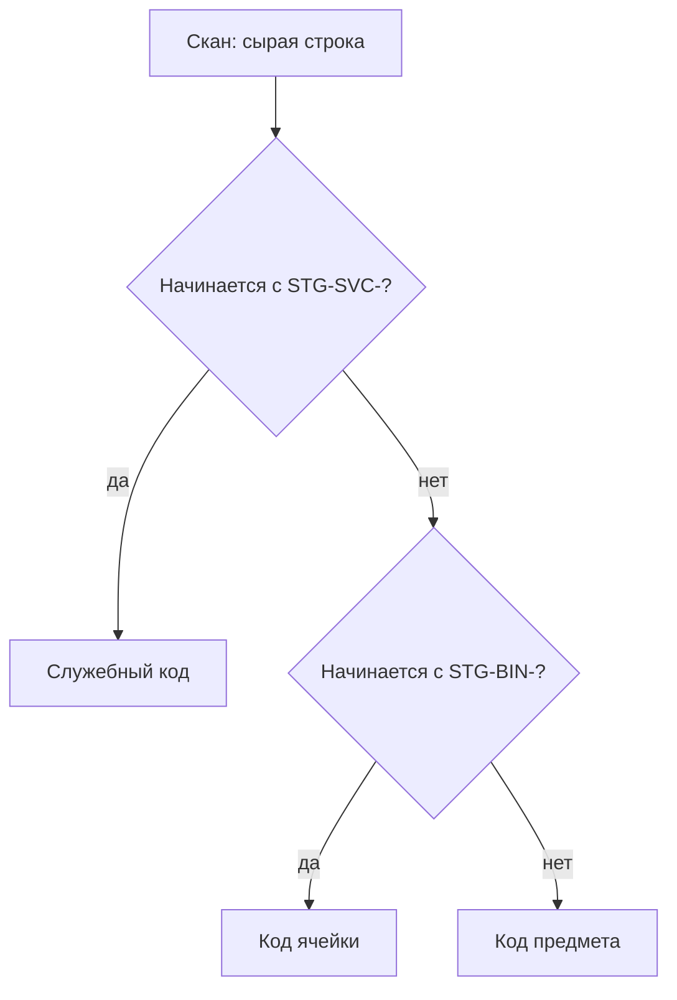
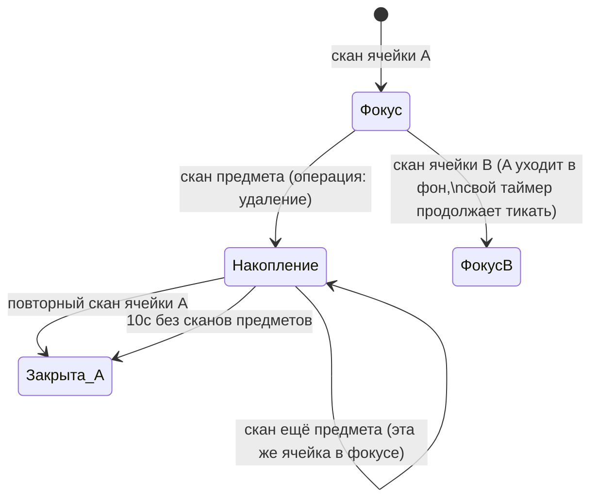
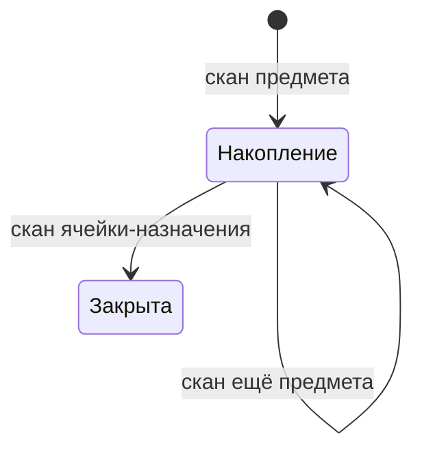
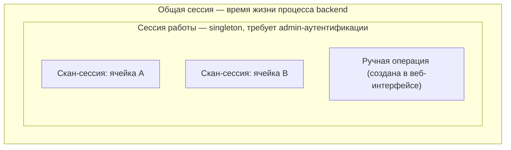
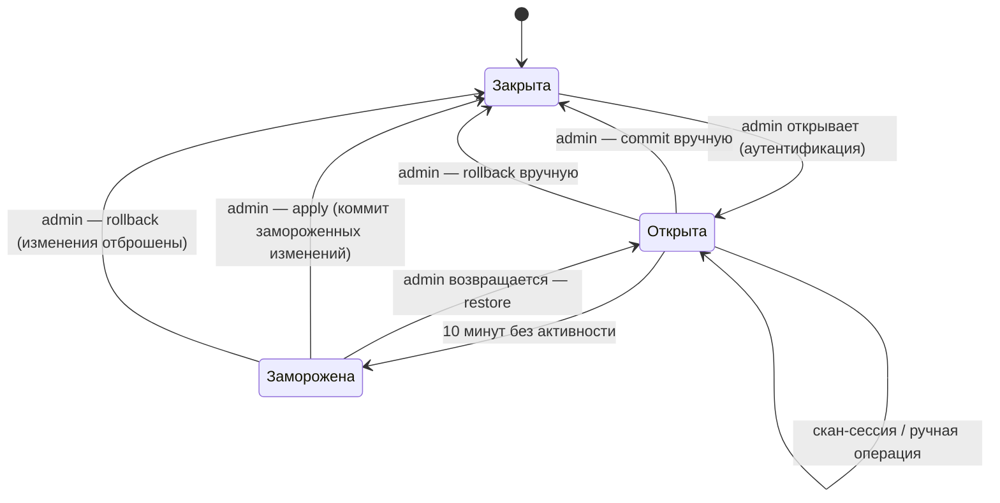

# Грамматика сканирования

Фиксирует, как последовательности сканов (и ручные действия в веб-интерфейсе)
превращаются в складские операции. Дополняет разделы «Модель данных» и
«Открытые вопросы» в [корневом README](../README.md) — в частности, закрывает
открытый вопрос №2 (формат штрихкодов).

Решения ниже — результат обсуждения и зафиксированы как согласованные, если не
помечены иначе. Пункты, помеченные **⚠️ открыто**, — моё предложение, которое
явно ещё не подтверждено и требует решения перед реализацией.

## 1. Классификация кода при сканировании

Ячейки и служебные коды печатает сам оператор на своём принтере — значит их
формат полностью в его руках. Предметы часто приходят с родным
штрихкодом/DataMatrix от производителя — над ним контроля нет. Поэтому
разбор идёт по зарезервированному префиксу, а не по длине/формату кода:

- `STG-BIN-*` — код ячейки, печатается при её создании в веб-интерфейсе.
- `STG-SVC-*` — служебный код (см. §5).
- Всё остальное — код предмета, в любом штатном для сканера формате
  (EAN/UPC/QR/DataMatrix).

## 2. Сущности

Ключевое: **предмет** — это «тип + количество» (без серийного учёта), а
**ячейка** — либо `mono` (жёстко привязана к одному типу предмета), либо
`poly` (хранит разные типы). Количество живёт в `BIN_STOCK`, не в `ITEMS`.

### Упаковки (вложенные предметы)

Пример: коробка канюль Accu-Chek — на коробке один штрихкод, внутри 10 штук
с собственными DataMatrix-кодами. `ITEM_PACK_CONTENTS` — таблица связи
многие-ко-многим (не пара плоских полей на `ITEMS`), чтобы заложить
возможность смешанной упаковки (несколько разных дочерних типов в одной
коробке), даже если сейчас нужен только частный случай «1 тип × N штук».

- Пока предмет не размечен как упаковка — его штрихкод ведёт себя как у
  обычного предмета.
- Разметка («это упаковка, внутри N штук предмета Y») делается в
  веб-интерфейсе и правится в любой момент, без пересканирования.
- При создании/редактировании упаковки можно **на месте создать новый
  дочерний тип предмета**, если его ещё нет в БД — отдельный переход в
  карточку предмета не нужен.
- Разворачивание (см. §4) применяется симметрично и при добавлении, и при
  удалении **⚠️ открыто** — предложено по умолчанию, явного подтверждения
  для направления «удаление» не было.

## 3. Ячейки: создание и границы сканера

- **Ячейка (любого типа) не может появиться из скана.** Неизвестный код с
  префиксом `STG-BIN-` — всегда ошибка. Сначала ячейка создаётся в
  веб-интерфейсе (параметры, для mono — привязка к типу предмета), потом
  печатается этикетка, только потом ячейка участвует в сканировании.
- Для `mono`-ячеек скан вообще не участвует в изменении количества —
  пополнение/списание там только через веб-форму (поле «количество»).
  Причина: сканер плохо подходит для ввода произвольных чисел без
  дополнительных вспомогательных кодов.
- На карточке ячейки — кнопка «напечатать ещё одну этикетку» (например,
  для замены потрёпанной наклейки на боксе).

## 4. Грамматика для `poly`-ячеек

Порядок скана определяет операцию, отдельный код-модификатор не нужен:

| Первый скан | Второй скан | Операция |
|---|---|---|
| ячейка | предмет | **удаление** предмета из ячейки |
| предмет | ячейка | **добавление**/перемещение предмета в ячейку |

Если предмет неизвестен БД — создаётся пустая карточка (без штрихкода за
исключением самого просканированного), поля заполняются позже через
веб-интерфейс. Если предмет уже привязан к другой ячейке — он отвязывается
от старой и привязывается к новой (перемещение).

### 4.1. Накопление и «фокус»

Одна операция не обязана быть строго парой из двух сканов — она может
накапливать несколько предметов подряд, пока не будет явно закрыта.
**Фокус** — это последняя отсканированная ячейка; новые сканы предметов
(без явного скана ячейки перед ними) всегда уходят в операцию ячейки,
которая сейчас в фокусе.

Если во время открытой операции над ячейкой A сканируется ячейка B — операция
над A **не отменяется и не закрывается принудительно**, она продолжает
существовать и закроется собственным таймаутом (или повторным сканом A
позже). Фокус переключается на B, и все следующие «голые» сканы предметов
идут уже в операцию B. Так поддерживается несколько параллельно открытых
операций по разным ячейкам — каждая с собственным independent-таймером,
но приём новых предметов — только у той, что сейчас в фокусе.

### 4.2. Различия add/remove в таймауте

- **Удаление** (`ячейка → предмет × N`): закрывается таймаутом **10 секунд**
  с момента последнего скана предмета, либо принудительно повторным сканом
  той же ячейки.
- **Добавление** (`предмет × N → ячейка`): отдельного таймаута **нет** —
  закрывается только сканом ячейки-назначения. Единственная подстраховка от
  «вечно висящего» набора предметов — общий таймаут бездействия всей сессии
  работы (10 минут, см. §6).

## 5. Служебные коды

Сканер читает QR, что даёт возможность закодировать служебные действия
отдельным префиксом `STG-SVC-*`.

- **`STOP_CUR_OP`** — прерывает операцию и откатывает её незакоммиченные
  изменения (в рамках буфера, не всей сессии работы). Область действия
  **⚠️ открыто**, предложено по аналогии с основной грамматикой:
  - код сам по себе (без ячейки следом, с таймаутом) — отменяет **все**
    открытые скан-сессии разом;
  - код + скан конкретной ячейки — отменяет только её сессию.

Другие служебные коды (undo последнего скана, ручной коммит и т.п.) пока не
обсуждались — при необходимости добавляются в это же адресное пространство
(`STG-SVC-*`).

## 6. Модель сессий

Три уровня, вложенные друг в друга:

- **Скан-сессия** — как описано в §4, живёт секунды/минуты, закрывается
  таймаутом или повторным сканом; её результат (одна или несколько операций
  add/remove) добавляется в буфер сессии работы сразу по закрытии — буфер
  пишется в БД немедленно, не держится только в памяти, чтобы падение
  сервера теряло максимум одну незакрытую скан-сессию, а не весь рабочий
  день.
- **Сессия работы** — **singleton**: пока одна открыта, новая открыться не
  может. Открывается только из веб-интерфейса через admin-аутентификацию
  (чтобы посторонний в сети не мог начать менять склад, только смотреть).
  Все остальные клиенты в это время — `ro`. Пока сессия открыта, в
  веб-интерфейсе видна её история в стиле git diff: `+N предмет X`
  (зелёным), `-N предмет Y` (красным), по каждой закрытой скан-сессии и
  ручной операции.
- **Общая сессия** — время жизни backend-процесса, к грамматике сканирования
  прямого отношения не имеет.

### 6.1. Заморозка и восстановление

По истечении 10 минут бездействия сессия работы **замораживается**, а не
коммитится автоматически — изменения остаются как есть, ничего не
применяется к основной БД без явного решения человека. При следующем входе
под админом система предлагает восстановить (продолжить с того же буфера),
применить как есть или откатить целиком.

## 7. Ручное редактирование буфера

Сканер — не единственный способ создать операцию. Everywhere, где виден
текущий буфер изменений (открытая или замороженная сессия работы), должно
быть можно:

- создать операцию вручную (выбрать ячейку, предмет, тип операции
  add/remove, количество) — без единого скана;
- отредактировать уже существующую строку буфера (количество);
- удалить строку буфера (отменить конкретную операцию, не весь буфер);
- добавить новую строку.

Ручная операция над предметом-упаковкой разворачивается в дочерние предметы
по тем же правилам, что и скан (§2) — вход в буфер (скан vs руками) не
влияет на то, как интерпретируется сам предмет.

## 8. Открытые вопросы

Явно не решено, требует ответа перед реализацией:

1. **STOP_CUR_OP** — область действия (§5): подтвердить или предложить
   другую семантику.
2. **Разворачивание упаковки при удалении** — применять ли то же
   разворачивание в дочерние предметы симметрично при удалении, или только
   при добавлении (§2, физически коробка обычно вскрывается один раз и
   штрихкод коробки больше не участвует в операциях).
3. **Формат записи трассировки упаковки в аудит-логе** — как именно в
   истории отображается связка «распознана упаковка X → добавлено N штук
   Y» (поле `via_pack_item_id` заложено в схему, конкретный текст/формат
   отображения — на этапе реализации UI).
4. Не обсуждалось: что происходит при попытке списать больше, чем есть в
   ячейке (уход в отрицательное количество) — блокировать в момент скана,
   или разрешать и показывать как предупреждение при ревью буфера.
