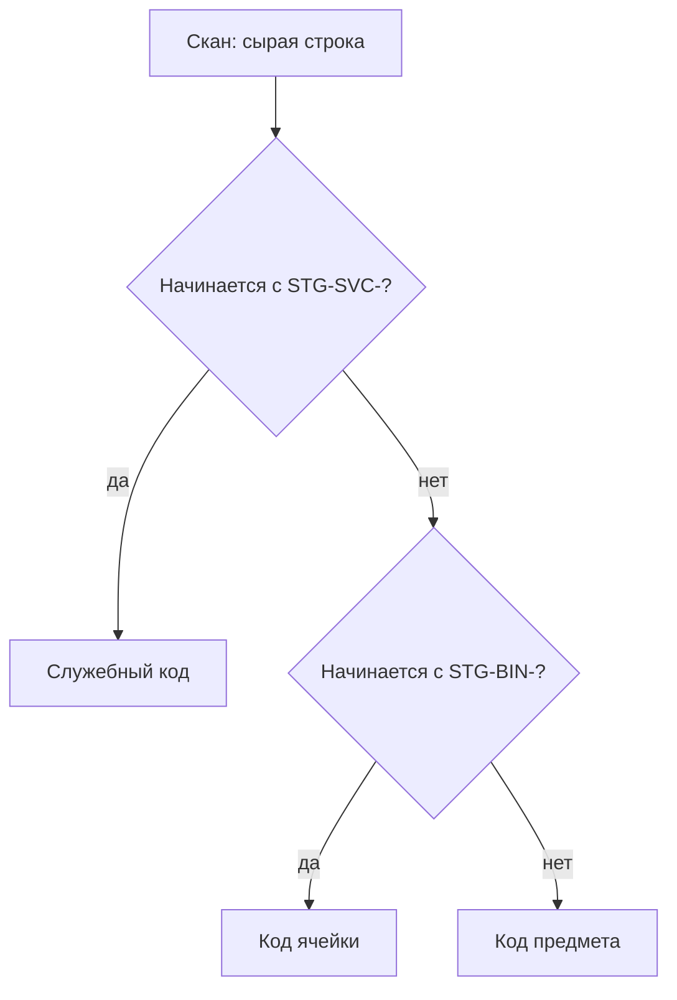
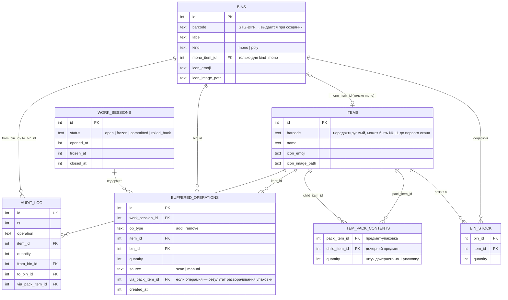
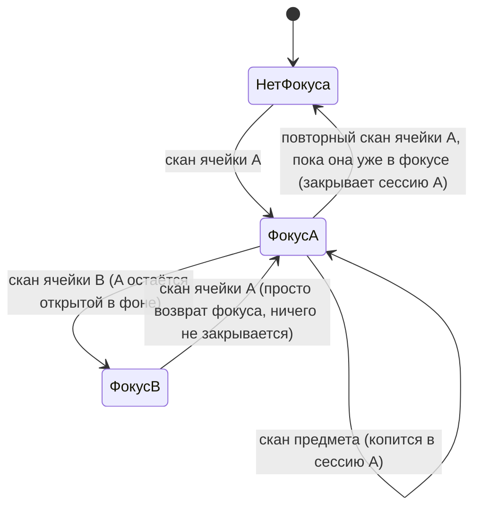
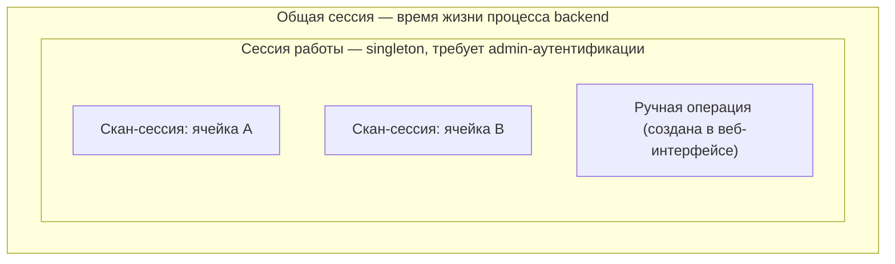
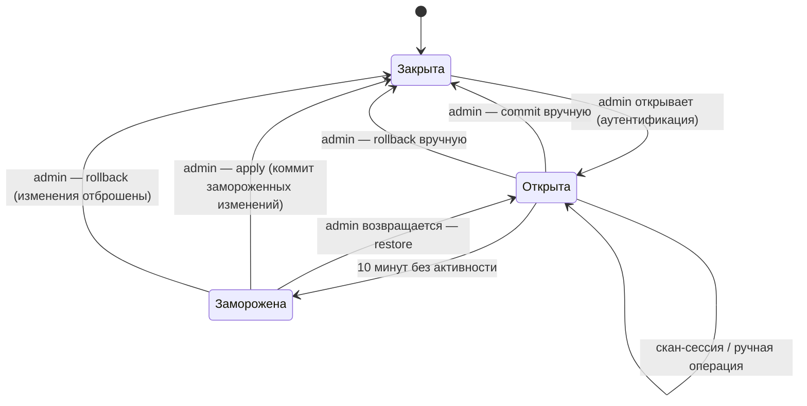

# Грамматика сканирования

Фиксирует, как последовательности сканов (и ручные действия в веб-интерфейсе)
превращаются в складские операции. Дополняет разделы «Модель данных» и
«Открытые вопросы» в [корневом README](../README.md) — в частности, закрывает
открытый вопрос №2 (формат штрихкодов).

Решения ниже — результат обсуждения и зафиксированы как согласованные, если не
помечены иначе. Пункты, помеченные **⚠️ открыто**, — моё предложение, которое
явно ещё не подтверждено и требует решения перед реализацией.

## 1. Классификация кода при сканировании

Ячейки и служебные коды печатает сам оператор на своём принтере — значит их
формат полностью в его руках. Предметы часто приходят с родным
штрихкодом/DataMatrix от производителя — над ним контроля нет. Поэтому
разбор идёт по зарезервированному префиксу, а не по длине/формату кода:

- `STG-BIN-*` — код ячейки, печатается при её создании в веб-интерфейсе.
- `STG-SVC-*` — служебный код (см. §5).
- Всё остальное — код предмета, в любом штатном для сканера формате
  (EAN/UPC/QR/DataMatrix).

## 2. Сущности

Ключевое: **предмет** — это «тип + количество» (без серийного учёта), а
**ячейка** — либо `mono` (жёстко привязана к одному типу предмета), либо
`poly` (хранит разные типы). Количество живёт в `BIN_STOCK`, не в `ITEMS`.

### Упаковки (вложенные предметы)

Пример: коробка канюль Accu-Chek — на коробке один штрихкод, внутри 10 штук
с собственными DataMatrix-кодами. `ITEM_PACK_CONTENTS` — таблица связи
многие-ко-многим (не пара плоских полей на `ITEMS`), чтобы заложить
возможность смешанной упаковки (несколько разных дочерних типов в одной
коробке), даже если сейчас нужен только частный случай «1 тип × N штук».

- Пока предмет не размечен как упаковка — его штрихкод ведёт себя как у
  обычного предмета.
- Разметка («это упаковка, внутри N штук предмета Y») делается в
  веб-интерфейсе и правится в любой момент, без пересканирования.
- При создании/редактировании упаковки можно **на месте создать новый
  дочерний тип предмета**, если его ещё нет в БД — отдельный переход в
  карточку предмета не нужен.
- Разворачивание (см. §4) применяется симметрично и при добавлении, и при
  удалении.
- В дифф-ленте сессии работы (§6) и в аудит-логе такая операция отображается
  не как голая дельта по дочернему предмету, а с явной трассировкой:
  `<название упаковки> => +N <название дочернего предмета>` (например,
  `Канюли Accu-Chek, уп. 10 шт => +10 Канюля Accu-Chek`).

## 3. Ячейки: создание и границы сканера

- **Ячейка (любого типа) не может появиться из скана.** Неизвестный код с
  префиксом `STG-BIN-` — всегда ошибка. Сначала ячейка создаётся в
  веб-интерфейсе (параметры, для mono — привязка к типу предмета), потом
  печатается этикетка, только потом ячейка участвует в сканировании.
- Для `mono`-ячеек скан вообще не участвует в изменении количества —
  пополнение/списание там только через веб-форму (поле «количество»).
  Причина: сканер плохо подходит для ввода произвольных чисел без
  дополнительных вспомогательных кодов.
- На карточке ячейки — кнопка «напечатать ещё одну этикетку» (например,
  для замены потрёпанной наклейки на боксе).

## 4. Грамматика для `poly`-ячеек

Порядок скана определяет операцию, отдельный код-модификатор не нужен:

| Первый скан | Второй скан | Операция |
|---|---|---|
| ячейка | предмет | **удаление** предмета из ячейки |
| предмет | ячейка | **добавление**/перемещение предмета в ячейку |

Если предмет неизвестен БД — создаётся пустая карточка (без штрихкода за
исключением самого просканированного), поля заполняются позже через
веб-интерфейс. Если предмет уже привязан к другой ячейке — он отвязывается
от старой и привязывается к новой (перемещение).

### 4.1. Накопление и «фокус»

Одна операция не обязана быть строго парой из двух сканов — она может
накапливать несколько предметов подряд, пока не будет явно закрыта.
Ровно одна ячейка в любой момент — **в фокусе**; все «голые» сканы предметов
(без непосредственно предшествующего им скана ячейки) уходят в сессию именно
той ячейки, что сейчас в фокусе.

Скан ячейки — это **переключатель (toggle)**, а не безусловное открытие или
закрытие:

1. Скан ячейки, которая **не** в фокусе (независимо от того, есть у неё уже
   открытая фоновая сессия, или это совсем новая ячейка) — переводит фокус
   на неё. Ничего не закрывается, в т.ч. её собственная фоновая сессия
   (если была) просто становится активной.
2. Скан ячейки, которая **уже в фокусе** — закрывает её сессию (столько
   предметов, сколько успели накопить, уходит в буфер как одна запись).
3. После закрытия сессии **фокус не перескакивает** на другую всё ещё
   открытую фоновую сессию, даже если такая есть — становится «нет фокуса».
   Возврат к любой из оставшихся открытых сессий — только явным повторным
   сканом её ячейки (правило 1).

Направление операции (add/remove) фиксируется в момент, когда сессия ячейки
только создаётся (первый скан её ячейки после «нет фокуса»), и дальше не
меняется до закрытия — по тому же правилу первого скана, что в таблице
выше: если на этот момент уже накопились непривязанные сканы предметов
(без ячейки) — это **добавление**; если ячейка отсканирована «с чистого
листа» — **удаление**. Любые дальнейшие сканы предметов, пока эта ячейка в
фокусе, продолжают то же направление.

Так поддерживается сколько угодно параллельно открытых сессий по разным
ячейкам — переключаться между ними можно в любом порядке, каждая просто
ждёт, пока к ней вернутся, либо закроется явным повторным сканом.

### 4.2. Закрытие: toggle vs таймаут

И добавление, и удаление закрываются **одинаково** — повторным сканом уже
сфокусированной ячейки (§4.1, правило 2). Отличие только одно:

- **Удаление** дополнительно закрывается **таймаутом 10 секунд** с момента
  последнего скана предмета в эту сессию — не нужно возвращаться и явно
  закрывать ячейку, если по ней всё, что нужно, уже взяли.
- **Добавление** отдельного таймаута не имеет — закрывается только явным
  повторным сканом ячейки-назначения. Подстраховка от «вечно висящего»
  набора — только общий таймаут бездействия всей сессии работы (10 минут,
  см. §6).

**⚠️ открыто:** тикает ли 10-секундный таймаут удаления **только пока
ячейка в фокусе**, или в фоне тоже? Если в фоне — сценарий «ушёл к другой
ячейке, вернулся через минуту» ломается именно для удаления (сессия успеет
закрыться таймаутом до возврата), хотя для добавления он уже точно работает
(там таймаута нет вовсе). Предлагаю: таймаут считает только время, пока
ячейка сфокусирована — при уходе фокуса на другую ячейку он фактически
приостанавливается, при возврате продолжает отсчёт с последнего скана
предмета в эту сессию.

### 4.3. Ограничение на количество при удалении

Нельзя увести остаток по предмету в ячейке в отрицательное значение: если
пытаются списать больше, чем есть в наличии — операция не добавляется в
буфер, вместо этого подаётся сигнал ошибки (звук и/или предупреждение на
экране о нехватке). Канал этого сигнала (звук — на чём именно, экран — на
каком конкретно устройстве) упирается в тот же вопрос, что был отложен
раньше (обратная связь оператору при одиночном сканере, закреплённом за
сервером, а не за конкретным клиентом) — решаем вместе, когда вернёмся к
нему.

## 5. Служебные коды

Сканер читает QR, что даёт возможность закодировать служебные действия
отдельным префиксом `STG-SVC-*` (см. §1) — адресное пространство под них
зарезервировано в схеме кодов.

Отдельный код вроде `STOP_CUR_OP` пока **не нужен**: грамматика §4.1 уже
покрывает, как закрыть (или бросить, просто уйдя к другой ячейке) любую
операцию без дополнительных сигналов. Возвращаемся к этому разделу, только
если на практике всплывёт сценарий, который существующими правилами не
закрывается.

## 6. Модель сессий

Три уровня, вложенные друг в друга:

- **Скан-сессия** — как описано в §4, живёт секунды/минуты, закрывается
  таймаутом или повторным сканом; её результат (одна или несколько операций
  add/remove) добавляется в буфер сессии работы сразу по закрытии — буфер
  пишется в БД немедленно, не держится только в памяти, чтобы падение
  сервера теряло максимум одну незакрытую скан-сессию, а не весь рабочий
  день.
- **Сессия работы** — **singleton**: пока одна открыта, новая открыться не
  может. Открывается только из веб-интерфейса через admin-аутентификацию
  (чтобы посторонний в сети не мог начать менять склад, только смотреть).
  Все остальные клиенты в это время — `ro`. Пока сессия открыта, в
  веб-интерфейсе видна её история в стиле git diff: `+N предмет X`
  (зелёным), `-N предмет Y` (красным), по каждой закрытой скан-сессии и
  ручной операции.
- **Общая сессия** — время жизни backend-процесса, к грамматике сканирования
  прямого отношения не имеет.

### 6.1. Заморозка и восстановление

По истечении 10 минут бездействия сессия работы **замораживается**, а не
коммитится автоматически — изменения остаются как есть, ничего не
применяется к основной БД без явного решения человека. При следующем входе
под админом система предлагает восстановить (продолжить с того же буфера),
применить как есть или откатить целиком.

## 7. Ручное редактирование буфера

Сканер — не единственный способ создать операцию. Везде, где виден текущий
буфер изменений (открытая или замороженная сессия работы), должно быть
можно:

- создать операцию вручную (выбрать ячейку, предмет, тип операции
  add/remove, количество) — без единого скана;
- отредактировать уже существующую строку буфера (количество);
- удалить строку буфера (отменить конкретную операцию, не весь буфер);
- добавить новую строку.

Ручная операция над предметом-упаковкой разворачивается в дочерние предметы
по тем же правилам, что и скан (§2) — вход в буфер (скан vs руками) не
влияет на то, как интерпретируется сам предмет.

## 8. Открытые вопросы

Явно не решено, требует ответа перед реализацией:

1. **Тикает ли 10-секундный таймаут удаления в фоне, пока ячейка не в
   фокусе** (§4.2) — предложено, что нет (пауза, пока не в фокусе), явного
   подтверждения не было.
2. **Канал обратной связи оператору** (§4.3) — куда подавать сигнал ошибки
   при попытке уйти в минус (и, в перспективе, куда пушить остальные
   уведомления/lookup из более ранних набросков): сканер закреплён за
   сервером, а не за конкретным браузером/устройством. Варианты — локальный
   звук на сервере, выделенный «дежурный» экран рядом со сканером, что-то
   ещё. Осознанно отложено с самого начала обсуждения, но пора решить хотя
   бы для этого конкретного случая (ошибка нехватки количества).
